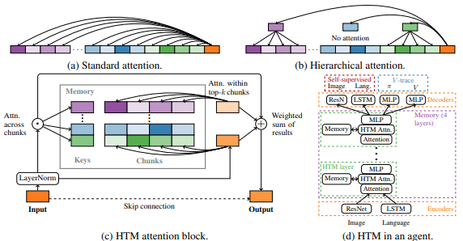

</img>

## Hierarchical Transformer Memory (HTM) - Pytorch

Implementation of <a href="https://arxiv.org/abs/2105.14039">Hierarchical Transformer Memory</a> (HTM) for Pytorch. This Deepmind paper proposes a simple method to allow transformers to attend to memories of the past efficiently. <a href="https://github.com/deepmind/deepmind-research/tree/master/hierarchical_transformer_memory">Original Jax repository</a>

## Install

```bash
$ pip install htm-pytorch
```

## Usage

```python
import torch
from htm_pytorch import HTMAttention

attn = HTMAttention(
    dim = 512,
    heads = 8,               # number of heads for within-memory attention
    dim_head = 64,           # dimension per head for within-memory attention
    topk_mems = 8,           # how many memory chunks to select for
    mem_chunk_size = 32,     # number of tokens in each memory chunk
    add_pos_enc = True       # whether to add positional encoding to the memories
)

queries = torch.randn(1, 128, 512)     # queries
memories = torch.randn(1, 20000, 512)  # memories, of any size
mask = torch.ones(1, 20000).bool()     # memory mask

attended = attn(queries, memories, mask = mask) # (1, 128, 512)
```

If you want the entire HTM Block (which contains the layernorm for the input followed by a skip connection), just import `HTMBlock` instead

```python
import torch
from htm_pytorch import HTMBlock

block = HTMBlock(
    dim = 512,
    topk_mems = 8,
    mem_chunk_size = 32
)

queries = torch.randn(1, 128, 512)
memories = torch.randn(1, 20000, 512)
mask = torch.ones(1, 20000).bool()

out = block(queries, memories, mask = mask) # (1, 128, 512)
```

## Citations

```bibtex
@misc{lampinen2021mental,
    title   = {Towards mental time travel: a hierarchical memory for reinforcement learning agents}, 
    author  = {Andrew Kyle Lampinen and Stephanie C. Y. Chan and Andrea Banino and Felix Hill},
    year    = {2021},
    eprint  = {2105.14039},
    archivePrefix = {arXiv},
    primaryClass = {cs.LG}
}
```
